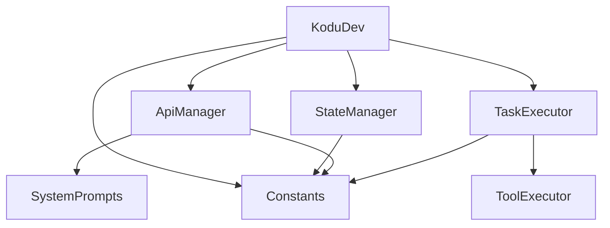
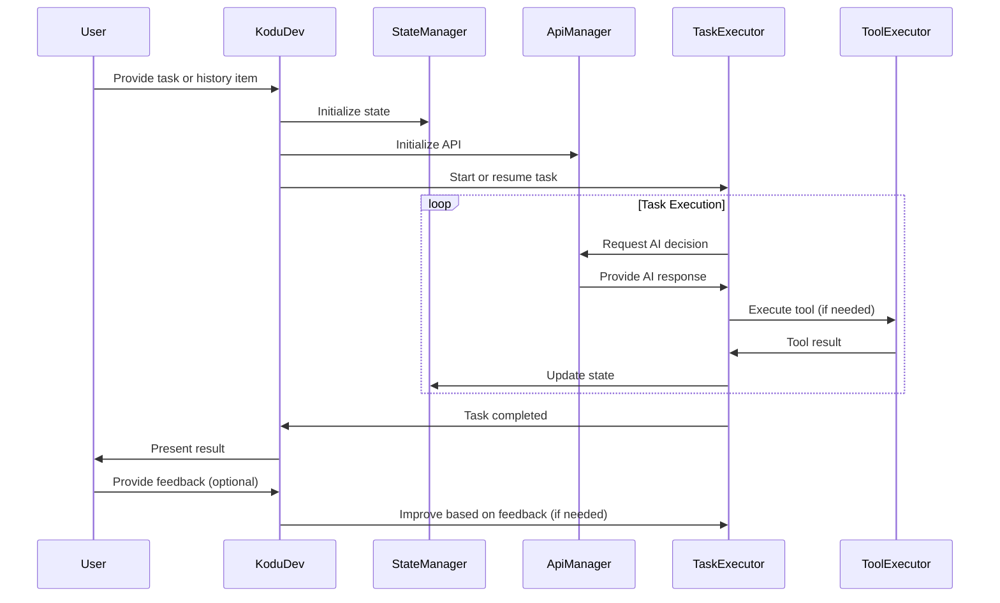

# Claude Dev Agent System Diagrams

This document provides visual representations of the Claude Dev agent system's structure and flow.

## Component Diagram

The following diagram illustrates the relationships between the main components of the system:

### Explanation:

- KoduDev acts as the central coordinator, interacting directly with ApiManager, StateManager, and TaskExecutor.
- TaskExecutor uses ToolExecutor for specific actions.
- ApiManager utilizes SystemPrompts to guide AI interactions.
- Constants are used throughout the system for configuration, accessed by multiple components.

## Sequence Diagram

The following sequence diagram shows the flow of execution from the user's initial input to the final result presentation:

### Explanation:

1. The user initiates the process by providing a task or history item to KoduDev.
2. KoduDev sets up the initial state and API connection.
3. TaskExecutor begins the task execution process.
4. The main execution loop involves:
   - Requesting AI decisions from ApiManager
   - Executing tools via ToolExecutor when needed
   - Updating the state through StateManager
5. Once the task is completed, the result is presented to the user.
6. The user may provide feedback, which can lead to further improvements in the task execution.

These diagrams provide a clear visual representation of the system's architecture and execution flow, helping to understand how the different components interact to process tasks and respond to user input.